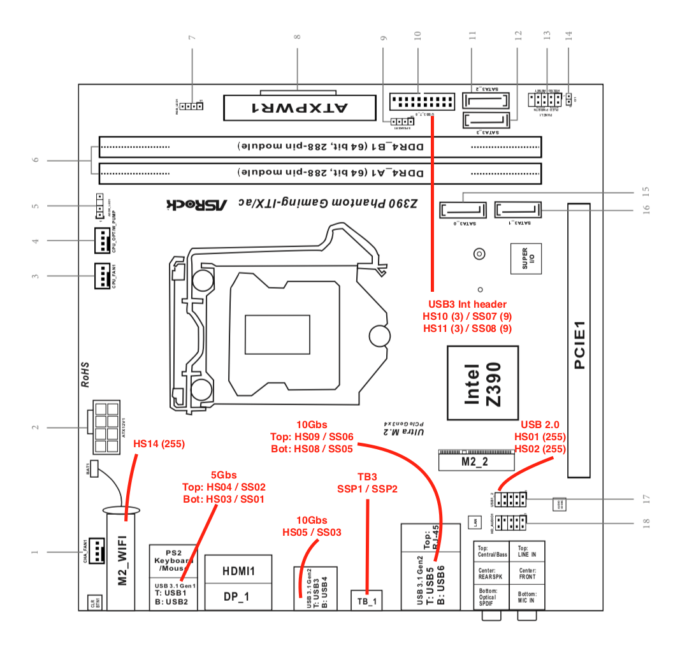
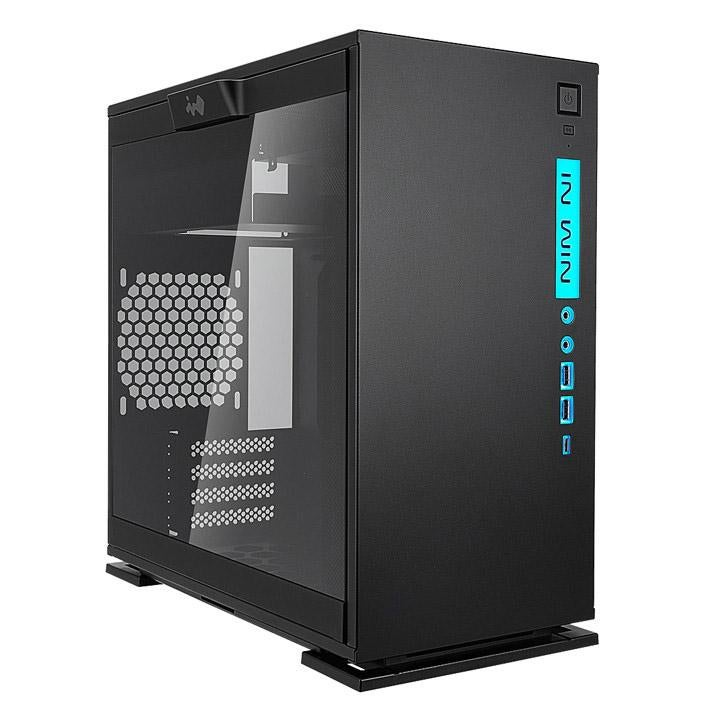

# OpenCore on ASRock Z390 Phantom Gaming/ITXac

Vanilla build with [OpenCore 0.6.1](https://github.com/acidanthera/OpenCorePkg/releases/download/0.6.1/OpenCore-0.6.1-RELEASE.zip) on [ASRock Z390 Phantom Gaming/ITX](https://www.asrock.com/mb/Intel/Z390%20Phantom%20Gaming-ITXac/index.asp), macOS Mojave 10.14.6 and Windows 10 on separate drive(NVMe)

## Hardware List
| Name                            | Value                                             |
|:------------------------------- | :------------------------------------------------ |
| CPU                             | Intel i7-9700K @ 3.6Ghz                           |
| CPU                             | Sapphire AMD Radeon RX580 & iGPU in headless mode |
| Motherboard                     | AsRock Z390 Phantom Gaming ITX/ac                 |
| CPU Cooler                      | Arctic Freezer 34 CPU Cooler                      |
| RAM                             | 32GB HyperX Fury DDR4 (2x16GB) - 3200Mhz (XMP)    |
| OS Drive (macOS)                | Samsung 970 EVO 1TB NVMe                          |
| Windows 10 Drive                | Samsung 970 EVO 512GB NVMe                        |
| Other Drives                    | 2TB spinning HD for DATA                          |
| PSU                             | Using some old 700W PSU.                          |
| Display                         | Apple 27" Cinema Display (DisplayPort)            |
| Case                            | In-Win 301c Case w/USB-C at front w/RGB-Led (mATX)|

Using some old PSU I had which works fine, but a little noisy. Going to replace it with
a Corsair SF750 (750W) which should be small and silent.

Currently using the iGPU in headless mode and the Radeon RX 580 to drive everything
in macOS and gaming in Windows 10.
This motherboard came with a Intel 2T2R wifi and bluetooth card whichi I will replace
as soon as the Broadcom BCM94360NG arrives. Then I should have fully functional WiFI
and Bluetooth (Apple Stock) with no drivers.
I also did some hacking around the BIOS and replaced to the stock ASRock logo and
replaced it with Apple Logo.
I have mostly used Gigabyte motherboards for previous builds, but this build
was incredibly easy and solid.

Using the iMac19,1 as smbios and everything just works.

## What does not work ?
- Have not tried out the USB-C and TB3 as I don't have any of those equipment.

## OpenCore drivers
- HfsPlus.efi
- OpenCanoby.efi
- OpenRuntime.efi

## Kexts using with OpenCore
- Lilu.Kext (requirement!)
- [AGPMInjector.kext](https://github.com/Pavo-IM/AGPMInjector)
- AppleALC.kext
- IntelMausi.kext
- IOElectrify.kext
- NVMeFix.kext
- SMCProcessor.kext
- SMCSuperIO.kext
- USBMap.kext (After USB Ports Discovery, not to be used with USBInjectAll.kext)
- VirtualSMC.kext (requirement!)
- WhateverGreen.kext (requirement!)
- XHCI-unsupported.kext (required with ASRock motherboard)

# System Specific SSDT and ACPI
- SSDT-AWAC.aml
- SSDT-EC-USBX-DESKTOP.aml
- SSDT-PLUG-DRTNIA.aml
- SSDT-PMC.aml

# USB Mapped on my motherboard / case

I have injected the following ports in my config :
### High Speed   (USB 2) = HS03,HS04,HS08,HS09,HS10,HS11
### Super Speed  (USB 3) = SS01,SS02,SS07,SS08,SS09,SS10
- All USB ports are configured as Type 3 e.g. USB 3 ports which is backwards with USB2.0
### Internal (BT future) = HS14
- HS14 is set to 255(Internal Type) and is not disabled. If I will replace the card with a Broadcom type.
### No TB3 or USB-C stuff injected or tried as I dont have any devices to test.

### <u>I highly recommend to discover your ports and configure them accordingly 
### using the USB Map command and the [guide](https://dortania.github.io/OpenCore-Post-Install/usb/#macos-and-the-15-port-limit).</u>

# In-Win 301c Case

# Geekbench 5 Score (stock clocks, XMP profile enabled)

