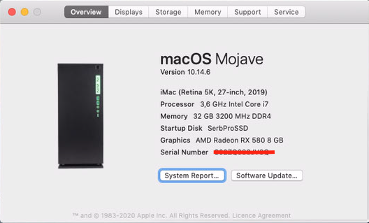

# OpenCore on ASRock Z390 Phantom Gaming/ITXac

Vanilla build with OpenCore 0.6.1 on [ASRock Z390 Phantom Gaming/ITX](https://www.asrock.com/mb/Intel/Z390%20Phantom%20Gaming-ITXac/index.asp), macOS Mojave 10.14.6 and Windows 10 on separate drive(NVMe)

## Hardware List
| Name                            | Value                                             |
|:------------------------------- | :------------------------------------------------ |
| CPU                             | Intel i7-9700K @ 3.6Ghz                           |
| CPU                             | Sapphire AMD Radeon RX580 & iGPU in headless mode |
| Motherboard                     | AsRock Z390 Phantom Gaming ITX/ac                 |
| CPU Cooler                      | Arctic Freezer 34 CPU Cooler                      |
| RAM                             | 32GB HyperX Fury DDR4 (2x16GB) - 3200Mhz (XMP)    |
| OS Drive (macOS)                | Samsung 970 EVO 1TB NVMe                          |
| Windows 10 Drive                | Samsung 970 EVO 512GB NVMe                        |
| Other Drives                    | 2TB spinning HD for DATA                          |
| PSU                             | Using some old 700W PSU.                          |
| Display                         | Apple 27" Cinema Display (DisplayPort)            |

Using some old PSU I had which works fine, but a little noisy. Going to replace it with
a Corsair SF750 (750W) which should be small and silent.

Currently using the iGPU in headless mode and the Radeon RX 580 to drive everything
in macOS and gaming in Windows 10.
This motherboard came with a Intel 2T2R wifi and bluetooth card whichi I will replace
as soon as the Broadcom BCM94360NG arrives. Then I should have fully functional WiFI
and Bluetooth (Apple Stock) with no drivers.

Using the iMac19,1 as smbios and everything just works, mostly... :)

## What does not work ?
- Have not tried out the USB-C and TB3 as I don't have any of those equipment.
- I'm having trouble getting the computer to enter SLEEP (manually) which was no problem
when I used Clover as bootloader.
- Opencore takes much longer time to enter SLEEP mode then Clover. Tho, the display goes black and the spinning
HD turns off. But not the computer itself. "pmset -g log assertions" only tells me IODisplayWrangler is the fault.

